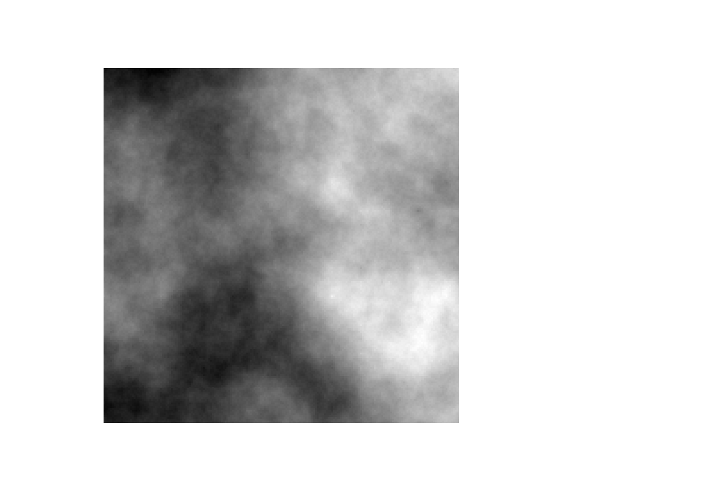

# `flsgen` A Fragmented Neutral Landscape Generator

[](https://github.com/dimitri-justeau/flsgen/actions/workflows/maven.yml) [](https://www.codacy.com/gh/dimitri-justeau/flsgen/dashboard?utm_source=github.com&amp;utm_medium=referral&amp;utm_content=dimitri-justeau/flsgen&amp;utm_campaign=Badge_Grade) [](https://codecov.io/gh/dimitri-justeau/flsgen)

`flsgen` is a neutral landscape generator that allow users to set targets on landscape indices. It first relies on Choco-solver to identify landscape structure satisfying user targets, then uses a stochastic algorithm to produce landscape rasters.

## Download and installation

Java 8+ must be installed in your system to run flsgen. For the command-line interface, only a JRE is necessary, whereas the Java API needs a full JDK. Download and installation instructions for Java are available here: https://www.oracle.com/java/technologies/javase-downloads.html, or here: https://openjdk.java.net/install/ .

### Command-line interface (CLI)

The most straighforward way to use fslgen it the command-line interface (CLI). Once Java is installed on your system, the only thing to do is to download the CLI jar file [here](https://github.com/dimitri-justeau/flsgen/releases/tag/1.0b). To test that everything is working properly, from a terminal navigate to the folder where you downloaded the jar file and use the following command:

```bash
java -jar flsgen-1.0-beta-SNAPSHOT.jar
```

You should get the following output:

```bash
Usage: FLSGen [-hV] [COMMAND]
A fragmented neutral landscape generator
  -h, --help      Show this help message and exit.
  -V, --version   Print version information and exit.
Commands:
  structure  Generate a landscape structure satisfying a set of targets.
  generate   Generate landscapes from given structures. To produce more
               realistic landscape, the algorithm relies on a terrain either
               given as input or automatically generated as a fractal terrain.
  terrain    Generate a fractal terrain using the Diamond-Square algorithm.
```

To avoid typing `java -jar flsgen-1.0-beta-SNAPSHOT.jar` each time you need to use flsgen, you can create the following alias: `alias flsgen='java -jar flsgen-1.0-beta-SNAPSHOT.jar'` in your `.bashrc` or `.profile` file (in Linux).

### Java API

To use the Java API, you can either download flsgen jar file [here](https://github.com/dimitri-justeau/flsgen/releases/tag/1.0b) and add it to you classpath, or clone this Github repository and install flsgen as a local Maven dependency using the following command:

```bash
mvn clean install
```

## Tutorial

### Generating a fractal terrain raster

From the CLI, you can easily generate a fractal terrain raster using the `flsgen terrain` CLI command:

```bash
Usage: FLSGen terrain [-hV] -H=<nbRows> [-r=<resolution>]
                      [-R=<roughnessFactor>] [-s=<srs>] [-t=<template>]
                      -W=<nbCols> [-x=<x>] [-y=<y>] <output>
Generate a fractal terrain using the Diamond-Square algorithm
      <output>            Path to the raster to generate as output
  -h, --help              Show this help message and exit.
  -H, --height=<nbRows>   Height (in pixels) of the terrain to generate
  -r, --resolution=<resolution>
                          Spatial resolution of the output raster (in CRS unit,
                            default 0.0001)
  -R, --roughness=<roughnessFactor>
                          Roughness parameter (also called H), between 0 and 1.
                            Lower values produce rougher terrain (0.5 by
                            default)
  -s, -srs, --spatial-reference-system=<srs>
                          Spatial reference system of the output raster
                            (default: EPSG:4326)
  -t, -ot, --output-template=<template>
                          Raster template to use for output raster metadata
  -V, --version           Print version information and exit.
  -W, --width=<nbCols>    Width (in pixels) of the terrain to generate
  -x=<x>                  Top left x coordinate of the output raster (default 0)
  -y=<y>                  Top left y coordinate of the output raster (default 0)
```

For example, if you want to generate a 200x200 fractal terrain with a roughness factor of 0.4 and default parameters, use the following command:

```bash
flsgen terrain -H 200 -W 200 -R 0.4 terrain.tif
```

You will get a fractal tif raster, e.g. :  




### Generating landscape structures from targets

### Generating landscape rasters from landscape structures.


