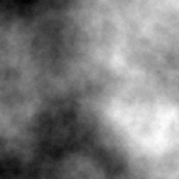
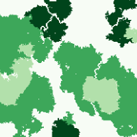
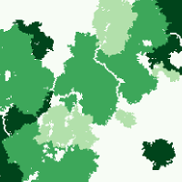

# `flsgen` A Fragmented Neutral Landscape Generator

[](https://github.com/dimitri-justeau/flsgen/actions/workflows/maven.yml) [](https://www.codacy.com/gh/dimitri-justeau/flsgen/dashboard?utm_source=github.com&amp;utm_medium=referral&amp;utm_content=dimitri-justeau/flsgen&amp;utm_campaign=Badge_Grade) [](https://codecov.io/gh/dimitri-justeau/flsgen)

`flsgen` is a neutral landscape generator that allows users to set targets on landscape indices. It first relies on Choco-solver to identify landscape structure satisfying user targets, then uses a stochastic algorithm to produce landscape rasters.

## Download and installation

Java 8+ must be installed in your system to run flsgen. For the command-line interface, only a JRE is necessary, whereas the Java API needs a full JDK. Download and installation instructions for Java are available here: https://www.oracle.com/java/technologies/javase-downloads.html, or here: https://openjdk.java.net/install/ .

### Command-line interface (CLI)

The most straightforward way to use fslgen is the command-line interface (CLI). Once Java is installed on your system, the only thing to do is to download the CLI jar file [here](https://github.com/dimitri-justeau/flsgen/releases/tag/1.0b). To test that everything is working properly, from a terminal navigate to the folder where you downloaded the jar file and use the following command:

```bash
java -jar flsgen-1.0-beta-SNAPSHOT.jar
```

You should get the following output:

```bash
Usage: FLSGen [-hV] [COMMAND]
A fragmented neutral landscape generator
  -h, --help      Show this help message and exit.
  -V, --version   Print version information and exit.
Commands:
  structure  Generate a landscape structure satisfying a set of targets.
  generate   Generate landscapes from given structures. To produce more
               realistic landscape, the algorithm relies on a terrain either
               given as input or automatically generated as a fractal terrain.
  terrain    Generate a fractal terrain using the Diamond-Square algorithm.
```

To avoid typing `java -jar flsgen-1.0-beta-SNAPSHOT.jar` each time you need to use flsgen, you can create the following alias: `alias flsgen='java -jar flsgen-1.0-beta-SNAPSHOT.jar'` in your `.bashrc` or `.profile` file (in Linux).

### Java API

To use the Java API, you can either download flsgen jar file [here](https://github.com/dimitri-justeau/flsgen/releases/tag/1.0b) and add it to your classpath, or clone this Github repository and install flsgen as a local Maven dependency using the following command:

```bash
mvn clean install
```

## Tutorial

### Generating a fractal terrain raster

#### From the CLI

Using the CLI, you can easily generate a fractal terrain raster using the `flsgen terrain` CLI command:

```bash
Usage: FLSGen terrain [-hV] -H=<nbRows> [-r=<resolution>]
                      [-R=<roughnessFactor>] [-s=<srs>] [-t=<template>]
                      -W=<nbCols> [-x=<x>] [-y=<y>] <output>
Generate a fractal terrain using the Diamond-Square algorithm
      <output>            Path to the raster to generate as output
  -h, --help              Show this help message and exit.
  -H, --height=<nbRows>   Height (in pixels) of the terrain to generate
  -r, --resolution=<resolution>
                          Spatial resolution of the output raster (in CRS unit,
                            default 0.0001)
  -R, --roughness=<roughnessFactor>
                          Roughness parameter (also called H), between 0 and 1.
                            Lower values produce rougher terrain (0.5 by
                            default)
  -s, -srs, --spatial-reference-system=<srs>
                          Spatial reference system of the output raster
                            (default: EPSG:4326)
  -t, -ot, --output-template=<template>
                          Raster template to use for output raster metadata
  -V, --version           Print version information and exit.
  -W, --width=<nbCols>    Width (in pixels) of the terrain to generate
  -x=<x>                  Top left x coordinate of the output raster (default 0)
  -y=<y>                  Top left y coordinate of the output raster (default 0)
```

For example, if you want to generate a 200x200 fractal terrain with a roughness factor of 0.4 and default parameters, use the following command:

```bash
flsgen terrain -H 200 -W 200 -R 0.4 terrain.tif
```

You will get a fractal tif raster, e.g. :



#### From the Java API

To achieve the same result with the Java API:

```java
import org.flsgen.grid.regular.square.RegularSquareGrid;
import org.flsgen.solver.Terrain;
import org.opengis.referencing.FactoryException;

import java.io.IOException;

public class FractalTerrainTest {

    public static void main(String[] args) throws IOException, FactoryException {
        RegularSquareGrid grid = new RegularSquareGrid(200, 200);
        Terrain t = new Terrain(grid);
        t.generateDiamondSquare(0.4);
        t.exportRaster(0, 0, 0.01, "EPSG:4326", "terrain.tif");
    }
}
```

### Generating landscape structures from targets

Say that we want to generate a landscape structure for a 200x200 landscape containing three landscape classes (plus a background class), with the following user targets:

| Class | NP      | AREA        | CA           | MESH | PLAND |
| ----- |---------| ----------- |------------- |------| ----- |
| 0     | [1, 10] | [300, 4000] | [1000, 5000] | 225  | -     |
| 1     | [2, 8]  | [200, 4000] |-             |-     | 40%   |
| 2     | [5, 7]  | [800, 1200] |-             |-     | -     |

The first step is to create a JSON file (e.g. `target.json`) describing these targets:

```json
{
  "nbRows" : 200,
  "nbCols" : 200,
  "classes" : [
    {
      "name" : "Class A", 
      "NP" : [1, 10], 
      "AREA" : [300, 4000], 
      "CA" : [1000, 5000], 
      "MESH" : [225, 225]
    }, 
    {
      "name" : "Class B", 
      "NP" : [2, 8], 
      "AREA" : [200, 4000], 
      "PLAND" : [40, 40]
    }, 
    {
      "name" : "Class C", 
      "NP" : [5, 7], 
      "AREA" : [800, 1200]
    }
  ]
}
```

#### From the CLI

Using the CLI, you can generate a non-spatially-explicit landscape structure using the `flsgen structure` command:

```bash
Usage: FLSGen structure [-hV] [-n=<nbSolutions>] [-s=<search>] <outputPrefix>
                        [<jsonPaths>...]
Generate a landscape structure satisfying a set of targets
      <outputPrefix>     JSON output file (or prefix for multiple structure
                           generation) for solution -- Use "-" to write to
                           STDOUT (only possible with one structure as input
                           and single-solution generation)
      [<jsonPaths>...]   JSON input file(s) describing landscape targets -- Use
                           "-" to read from STDIN (only possible with one
                           structure as input) -- Use multiple space-separated
                           paths to generate landscapes with different
                           structures.
  -h, --help             Show this help message and exit.
  -n, --nb-solutions=<nbSolutions>
                         Number of solutions to generate, if greater than one,
                           use a prefix for JSON output file (default: 1).
  -s, --search-strategy=<search>
                         Search strategy to use in the Choco org.flsgen.solver
                           (possible values: DEFAULT, RANDOM, DOM_OVER_W_DEG,
                           DOM_OVER_W_DEG_REF, ACTIVITY_BASED,
                           CONFLICT_HISTORY, MIN_DOM_UB, MIN_DOM_LB).
  -V, --version          Print version information and exit.

```

For example, from the previous targets file:

```bash
flsgen structure struct target.json
```

If there exist a landscape structure satisfying these targets, the program will write the output structure into the `struct_target.json` file.

#### From the Java API

To achieve the same result with the Java API:

```java
import org.flsgen.solver.LandscapeStructureSolver;
import org.flsgen.solver.LandscapeStructure;
import com.github.cliftonlabs.json_simple.JsonException;
import org.flsgen.exception.FlsgenException;

import java.io.FileReader;
import java.io.FileWriter;
import java.io.IOException;

public class StructureTest {

    public static void main(String[] args) throws IOException, JsonException, FlsgenException { {
        LandscapeStructureSolver ls = LandscapeStructureSolver.readFromJSON(new FileReader("target.json"));
        ls.build();
        LandscapeStructure struct = ls.findSolution();
        FileWriter writer = new FileWriter("struct_target.json");
        writer.write(struct.toJSON());
        writer.close();
    }
}
```

### Generating landscape rasters from landscape structures.

Now, let's generate a landscape raster from the previously generated structure.

#### From the CLI

Using the CLI, we use the `flsgen generate` command to generate a landscape raster from a landscape structure:

```bash
Usage: FLSGen generate [-hV] [-c=<connectivity>] [-D=<minDistance>]
                       [-e=<terrainOutput>] [-l=<terrainInput>] [-m=<maxTry>]
                       [-n=<nbLandscapes>] [-p=<maxTryPatch>] [-r=<resolution>]
                       [-R=<roughnessFactor>] [-s=<srs>] [-t=<template>]
                       [-T=<terrainDependency>] [-x=<x>] [-y=<y>]
                       <outputPrefix> [<jsonPaths>...]
Generate landscapes from given structures. To produce more realistic landscape,
the algorithm relies on a terrain either given as input or automatically
generated as a fractal terrain.
      <outputPrefix>     Output raster prefix path for generated landscape(s)
      [<jsonPaths>...]   JSON input file describing landscape structure -- Use
                           "-" to read from STDIN (only possible with one
                           structure as input) -- Use multiple space-separated
                           paths to generate landscapes with different
                           structures.
  -c, --connectivity=<connectivity>
                         Connectivity definition in the regular square org.
                           flsgen.grid - '4' (4-connected) or '8' (8-connected)
                           (default: 4).
  -D, --distance-between-patches=<minDistance>
                         Minimum distance (in number of cells) between patches
                           from a same class (default: 2).
  -e, -et, --export-terrain=<terrainOutput>
                         Set an output raster path to export the terrain used
                           to generate the landscape
  -h, --help             Show this help message and exit.
  -l, -lt, --load-terrain=<terrainInput>
                         Load the terrain used by the algorithm from a raster
                           instead of generating it
  -m, -mt, --max-try=<maxTry>
                         Maximum number or trials to generate the whole
                           landscape (default: 100).
  -n, --nb-landscapes=<nbLandscapes>
                         Number of landscapes to generate (default: 1).
  -p, -mtp, --max-try-patch=<maxTryPatch>
                         Maximum number of trials to generate a patch (default:
                           100).
  -r, --resolution=<resolution>
                         Spatial resolution of the output raster (in CRS unit,
                           default: 0.0001)
  -R, --roughness=<roughnessFactor>
                         Roughness parameter (also called H), between 0 and 1
                           for fractal terrain generation. Lower values produce
                           rougher terrain (default: 0.5)
  -s, -srs, --spatial-reference-system=<srs>
                         Spatial reference system of the output raster
                           (default: EPSG:4326)
  -t, -ot, --output-template=<template>
                         Raster template to use for output raster metadata
  -T, --terrain-dependency=<terrainDependency>
                         Terrain dependency of the patch generation algorithm,
                           between 0 and 1. 0 means no dependency to the
                           terrain, and 1 mean that patch generation is
                           entirely guided by the terrain (default: 0.5)
  -V, --version          Print version information and exit.
  -x=<x>                 Top left x coordinate of the output raster (default: 0)
  -y=<y>                 Top left y coordinate of the output raster (default: 0)
```

From the previous terrain raster and the previous structure JSON file, we can generate a landscape raster file with the following command:

```bash
flsgen generate -l terrain.tif landscape struct_target.json
```

This will generate the `landscape_struct_target.tif` raster file with default generation parameters. As the generation algorithm is randomized, you will get a different raster at each call, but always with the same patch sizes distribution.  Below are three examples of generated landscapes with the previous command.

      

#### From the Java API

To achieve the same with the Java API:

```java
import com.github.cliftonlabs.json_simple.JsonException;
import org.flsgen.exception.FlsgenException;
import org.flsgen.grid.neighborhood.INeighborhood;
import org.flsgen.grid.neighborhood.Neighborhoods;
import org.flsgen.grid.regular.square.RegularSquareGrid;
import org.flsgen.solver.LandscapeStructure;
import org.flsgen.solver.LandscapeGenerator
import org.flsgen.solver.Terrain;;
import org.opengis.referencing.FactoryException;

import java.io.FileReader;
import java.io.IOException;

public class GenerateTest {

    public static void main(String[] args) throws IOException, JsonException, FlsgenException, FactoryException {
        LandscapeStructure structure = LandscapeStructure.fromJSON(new FileReader("struct_target.json"));
        RegularSquareGrid grid = new RegularSquareGrid(200, 200);
        Terrain terrain = new Terrain(grid);
        terrain.loadFromRaster("terrain.tif");
        INeighborhood neighborhood = Neighborhoods.FOUR_CONNECTED;
        INeighborhood distance = Neighborhoods.TWO_WIDE_FOUR_CONNECTED;
        LandscapeGenerator generator = new LandscapeGenerator(structure, neighborhood, distance, terrain);
        generator.generate(0.5, 10,10);
        generator.exportRaster(0, 0, 0.001, "EPSG:4326", "landscape_struct_target.tif");
    }
}
```
